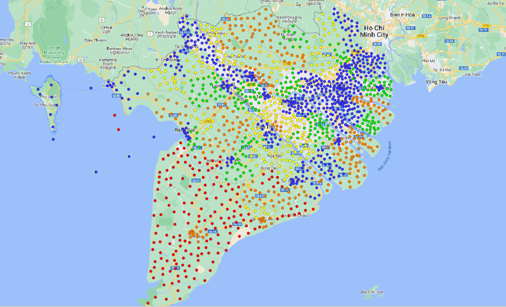

[](https://dss123.streamlit.app/)

# MKDC DSS 1,2,3
This repository contains code for Decision Support System 1, 2, 3 within the Mekong Delta Centre.

# Land Use Decision Support System for the Mekong Delta

- DSS1,2,3 is designed to calculate water quality, water supply and water shortage risk for the Mekong Delta Centre. 

## Features

- DSS1: calculate Water Quality Index (WQI)
- DSS2: calculate Water Supply Capacity Index (WSCI)
- DSS3: calculate Water Shortage Risk Index (WSRI)
	

## Prerequisites

- Docker installed on your machine.

## Getting Started

1. **Clone the Repository:**
    ```bash
    git clone https://github.com/thangqd/dss123.git
	```
	
2. **Create a .env file with an API key**

To access the Lizard webservice a valid API key is required. This is supplied in a .env file. An example file is available in the repo. 
	
3. **Build the Docker Image:**
	```bash
	cd dss123
	docker-compose build 
	```
	
4. **Run the Docker Container:**
    ```bash
    docker-compose up
	```

5. **Access the DSS:**

Open your web browser and go to http://localhost:8501 to interact with the Decision Support System.

## Support
For any inquiries or issues, please https://github.com/thangqd/dss123/issues


